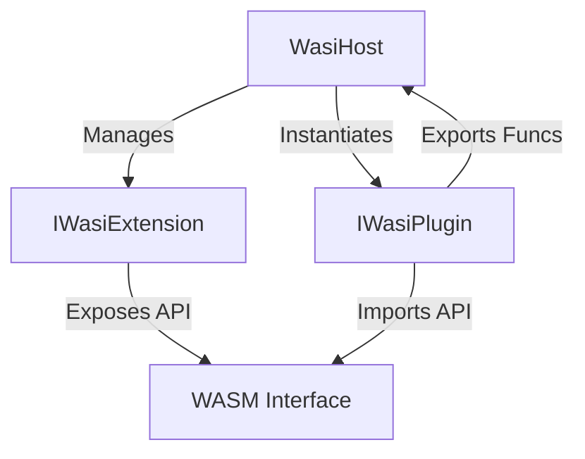

# Svelonia.Wasi API Reference

The **Svelonia.Wasi** namespace provides the core infrastructure for hosting WebAssembly (WASM) plugins within your .NET application. It uses the `Wasmtime` runtime and a custom Source Generator for high-performance, AOT-compatible interop.

## Architecture Overview



The system is designed around **Extensions**. The Host itself is a generic container; all actual functionality (Logging, Drawing, Network) is provided by modular extensions.

---

## Core Types

### `WasiHost`

The main entry point. Manages the Wasmtime Engine, Linker, and Store.

```csharp
var config = new WasiHostConfiguration {
    MaxFuel = 50_000_000 // Optional: Limit CPU usage
};
using var host = new WasiHost(config);
```

### `IWasiExtension`

Interface for defining functionality exposed to the Guest.

- **Must be a `partial class`** (for Source Generator support).
- **Must be decorated with `[WasiModule]`.**

### Attributes (Svelonia.Wasi)

#### `[WasiModule(string Namespace)]`

Applied to the class. Defines the import module name the WASM guest will see.

- **Namespace**: The module name, e.g., `"svelonia"`, `"wasi_snapshot_preview1"`.

#### `[WasiFunction(string Name)]`

Applied to methods. Exposes the method as an import to the WASM guest.

- **Name**: The function name, e.g., `"log"`, `"draw_rect"`.

---

## Creating Extensions (AOT Pattern)

To ensure compatibility with Native AOT (iOS/Android), Svelonia avoids reflection. Instead, it uses a **Source Generator** to create binding code at compile time.

**Pattern:**

1.  Create a `partial` class.
2.  Add attributes.
3.  Call `RegisterGenerated(linker, store)` in the `Register` method.

```csharp
[WasiModule("my_module")]
public partial class MyExtension : IWasiExtension
{
    private readonly WasiHost _host;
    public MyExtension(WasiHost host) => _host = host;

    // Exposed to WASM as "my_module::do_work"
    [WasiFunction("do_work")]
    public void DoWork(string input)
    {
        Console.WriteLine($"Working on: {input}");
    }

    public void Register(Linker linker, Store store)
    {
        // Generated by Svelonia.Gen analyzer
        RegisterGenerated(linker, store);
    }
}
```

---

## Security & Sandboxing

All plugins run isolated. You can restrict their capabilities using **Permissions**.

### defining Permissions

Extensions can check permissions before executing sensitive logic.

```csharp
public void DeleteFile()
{
    if (!_host.CheckPermission("filesystem.write"))
        throw new UnauthorizedAccessException("Plugin blocked.");
}
```

### Granting Permissions

Pass the allowed permissions when loading a plugin.

```csharp
var plugin = host.LoadPlugin("script.wasm", permissions: new[] { "filesystem.write" });
```

---

## Memory Model

### String Marshalling

- **Host -> Guest**: The Host calls `svelonia_alloc` (exported by Guest) to allocate memory, writes the string, and passes the pointer.
- **Guest -> Host**: The Guest passes `(ptr, len)`. The Host reads directly from linear memory.

### Complex Types

For complex objects, serialize them to JSON strings. The high-performance binder handles the string passing transparently.

---

## 📚 See Also

- **[Tutorial: Building a Rust Plugin](../tutorials/04-wasi-plugin-system.md)** - Step-by-step guide.
